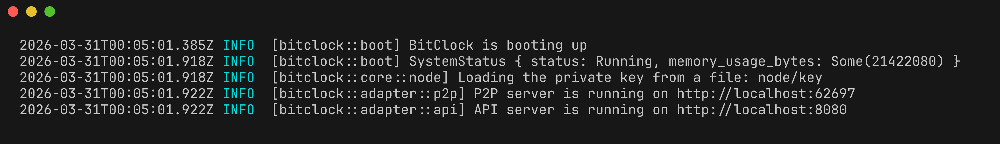

<div align="center">
    
    <h1>BitClock</h1>
</div>

BitClock is a distributed timestamp system without requiring consensus. Each node generates and shares stamps, which are then compiled into a proof, allowing the order in which the data was generated to be verified.

[](LICENSE)




> [!NOTE]
> BitClock is currently in active development. The API and features may change without notice.

## :sparkles: Features
- 🔒 **Instant finality** - A proof is finalized once it is validated by the network and cannot be reversed.
- 🏎️ **No consensus required**　- Timestamps can be issued without consensus.
- 🕰️ **Distributed timestamp without ledger** - We can verify timestamp without global ledgers or blockchains.
- ⚡ **Fast timestamp creation** - Once you've collected a certain number of stamps, you can create a proof right away.

## :shield: Attack Resistance
BitClock requires a certain amount of computational work via Proof of Work to generate timestamps and uses a Verifiable Delay Function (VDF) to ensure a fixed delay. This makes the system resistant to Sybil attacks.

## :dart: Use case
### Digital Certificates
With BitClock, you can not only create digital certificates but also prove their order.

## :clock4: Time sequence
BitClock does not have a global clock.
Instead, each node maintains a counter that serves as its local time, and the timeline is determined by observing changes in these counters. This timeline determination is performed by `compare_time`.

### [How does BitClock works?](docs/algorithm.md)

## :books: Documents
- About the algorithm - [algorithm](docs/algorithm.md)
- Tutorial - [Tutorial](docs/tutorial.md)

## :rocket: Getting Started
### Installation
```bash
# Clone the repository (or Download ZIP)
$ git clone https://github.com/kotagit75/bitclock.git

# Navigate to the project directory
$ cd bitclock

# build
$ cargo build --release
```
### Simple Example
- [Text-Proof](example/text-proof/README.md) - You can create simple proofs.

### [Tutorial](docs/tutorial.md)
### Usage
```bash
# run
$ ./target/release/bitclock bitclock

# get status
$ curl http://localhost:8080/status

# add peer
$ ./target/release/cli addpeer '[peer_ip_address]'

# create proof
$ ./target/release/cli proof '[recipient]' '[content]'

# get state(address, secret_key, pool, peers)
$ ./target/release/cli state

# get address
$ ./target/release/cli address

# get pool
$ ./target/release/cli pool

# get peers
$ ./target/release/cli peers

# find proof by secret key
$ ./target/release/cli find '[secret_key]'

# verify proof
$ ./target/release/cli verify '[proof]'

# compare the issuance times of the two proofs
$ ./target/release/cli compare '[secret_key1]' '[secret_key2]'

# sort proofs by time
$ ./target/release/cli sort

# display help
$ ./target/release/bitclock -h
Usage: bitclock [OPTIONS]

Options:
  -l, --level <LEVEL>        [default: INFO]
  -h, --help                 Print help
```

> [!CAUTION]
> Never make the `node` directory or any files within it publicly accessible. Doing so could result in the leakage of your private key.

## :jigsaw: APIs
Users can control BitClock via an HTTP server.

| implemented | method | endpoint | feature |
| ---- | ---- | ---- | ---- |
| <ul><li> [x] </ul> | `POST` | / | execute command |
| <ul><li> [x] </ul> | `GET` | /status | get status |
| <ul><li> [x] </ul> | `GET` | /query | get state |
| <ul><li> [x] </ul> | `GET` | /query/address | get address |
| <ul><li> [x] </ul> | `GET` | /query/pool | get proof pool |
| <ul><li> [x] </ul> | `GET` | /query/peers | get peers |
| <ul><li> [x] </ul> | `GET` | /query/compare | compare the issuance times of the two proofs |
| <ul><li> [x] </ul> | `GET` | /query/sort | sort proofs by time |

### Commands that can be executed at the `/` endpoint
- Add a peer - Post a request with `{"AddPeer": "peerIP"}` in the body
- Create proof - Post a request with `{"Proof": "some data"}` in the body

## :ticket: License
[BitClock is under the MIT License.](LICENSE)
